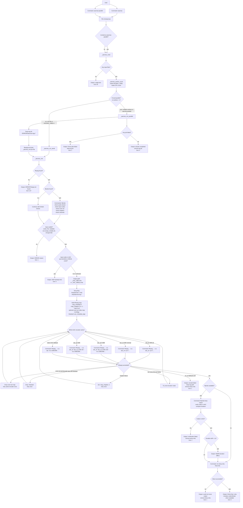

# aacmax System Diagram

## File and Runtime Inventory

| Item | Role |
| --- | --- |
| `bin/aacmax` | The whole application: CLI dispatch, serial/parallel scheduling, per-file conversion, retries, verification, and output move. |
| `README.md` | User-facing installation, usage, environment knobs, and exit-code documentation. |
| `.gitignore` | Ignores macOS/editor temp files and generated `.m4a` outputs. |
| `LICENSE` | MIT license. |
| `/tmp/aacmax.*.m4a` | Atomic temporary output before final move. |
| `/tmp/aacmax.log.*` | Per-file ffmpeg stderr log during conversion. |
| `$TMPDIR/aacmax-logs.*` | Parallel-mode job log directory; removed only when all jobs succeed. |
| `<input_dir>/<stem>_AAC_VBR.m4a` | Final output file. |
| `<input_dir>/<stem>_AAC_VBR(n).m4a` | Non-clobbering alternate output name when a prior output exists. |

## Command Surface

| Command or Variable | Effect |
| --- | --- |
| `aacmax <file...>` | Convert one or more files; one file runs serially, multiple files run in parallel. |
| `aacmax-parallel <file...>` | Force the parallel scheduler, even when worker count would otherwise be one. |
| `AACMAX_FORCE=1` | Re-encode inputs that are already AAC. |
| `AACMAX_JOBS=N` | Set exact parallel worker count; `1` forces serial mode. |
| `AACMAX_JOBS=auto` | Use automatic worker count, effectively CPU cores minus one, capped by file count. |
